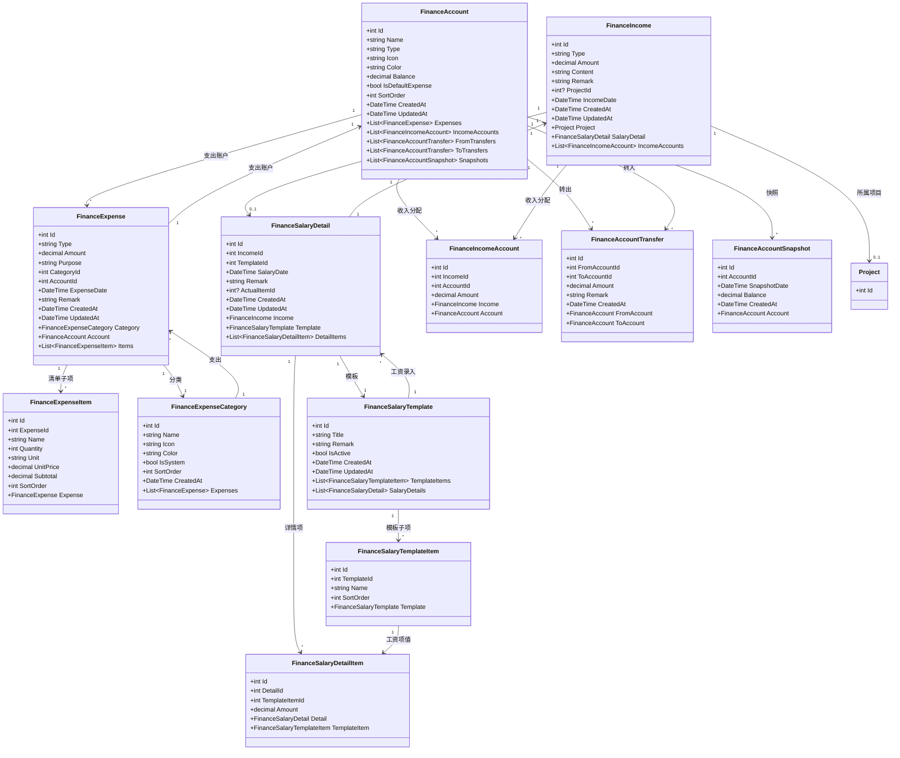
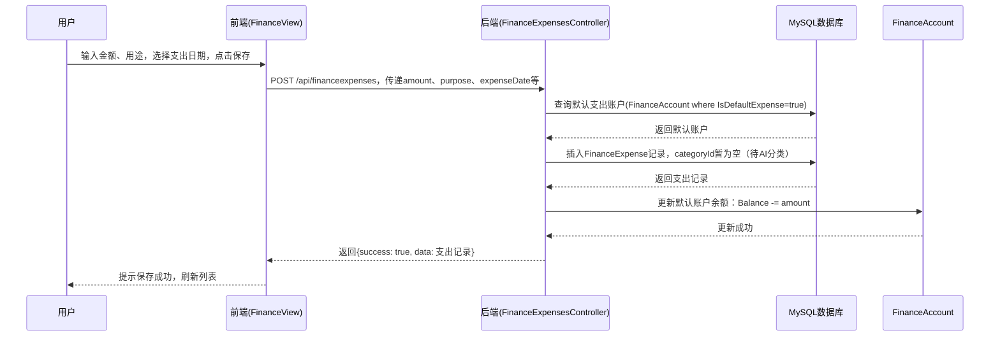
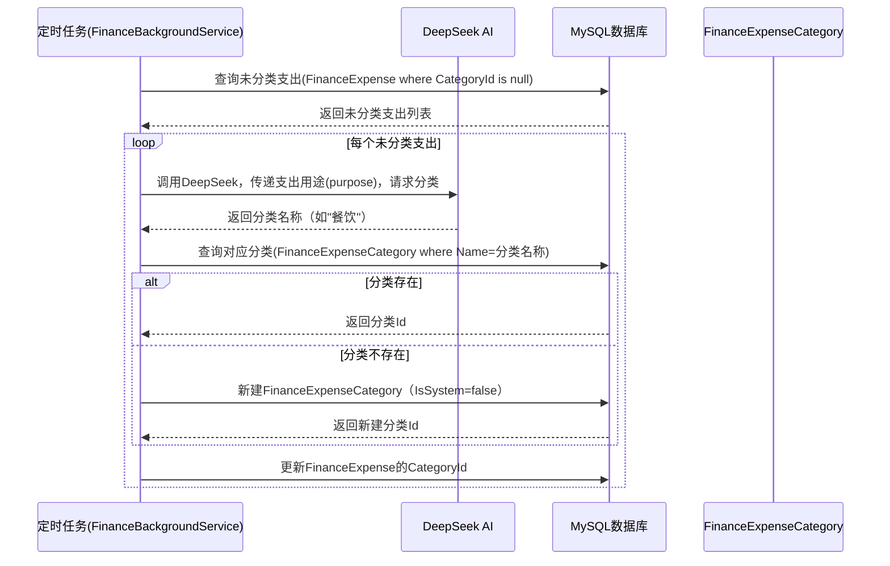
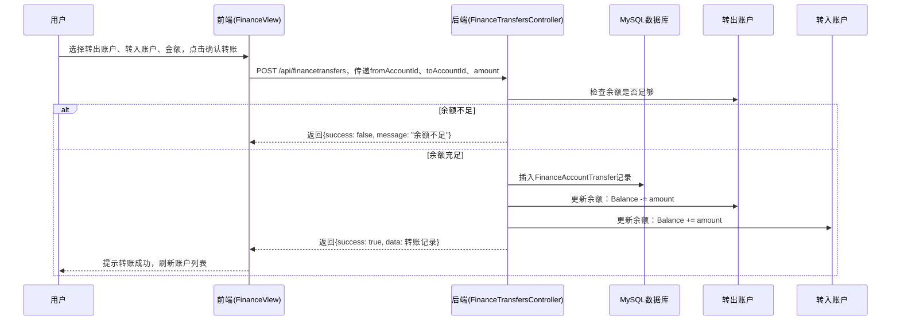
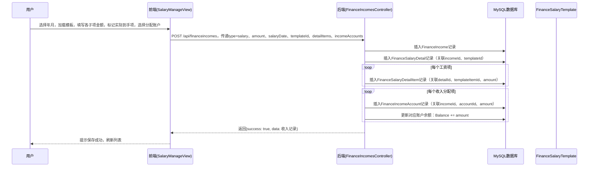
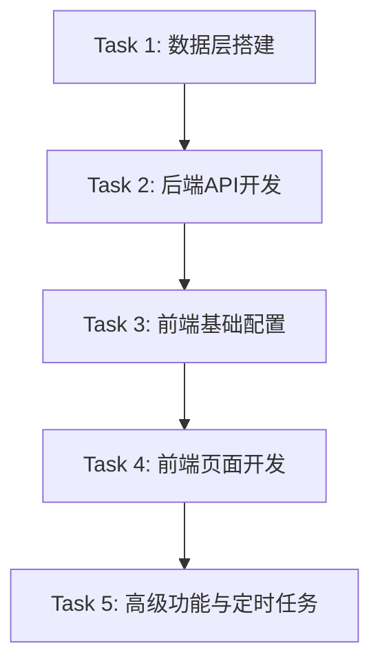

# AI Claw 财务模块架构设计文档
**架构师**：高见远（Gao）  
**日期**：2026-05-07  
**版本**：v1.0  

---

## Part A: 系统设计

### 1. 实现方案
#### 1.1 框架选型
完全遵循现有项目技术栈，无新增框架：
- **后端**：ASP.NET Core 9 + Entity Framework Core + MySQL 8.0，复用现有DeepSeek AI集成能力
- **前端**：Vue 3 + Vite + Pinia + TDesign + Vue Router + Axios + dayjs + lucide-vue-next
- **部署**：沿用现有Docker Compose方案（Nginx + API + MySQL），Electron封装不变

#### 1.2 架构模式
严格遵循项目现有代码模式：
- **后端**：MVC架构，Controller直接注入`AppDbContext`，使用EF Core LINQ查询，匿名对象返回数据（复杂场景除外）
- **数据库同步**：不在`api/Program.cs`中使用EF Core Migration，所有表结构通过原始SQL`CREATE TABLE IF NOT EXISTS`自动建表/补列
- **前端**：Vue 3组合式API + Pinia状态管理 + Vue Router路由，API方法统一封装到`projecthub/src/api/index.js`

#### 1.3 技术难点分析
| 难点 | 解决方案 |
|------|----------|
| 账户余额自动同步 | 在Controller中处理支出/收入/转账操作，同步更新关联账户余额，遵循现有代码逻辑模式 |
| AI自动分类定时任务 | 新增`FinanceBackgroundService`继承`BackgroundService`，每天23:59调用现有DeepSeek服务对未分类支出分类 |
| 工资模板与录入关联 | 工资录入时动态加载模板子项，通过`FinanceSalaryDetailItem`映射模板项与实际金额 |
| 账户余额快照 | 新增定时任务每天0点记录各账户余额到`FinanceAccountSnapshot`，用于绘制余额变化曲线 |

---

### 2. 文件列表（按目录分组）
#### 后端（api/目录）
##### 修改文件
- `api/Program.cs`：新增12张财务表的`CREATE TABLE IF NOT EXISTS` SQL语句，注册`FinanceBackgroundService`
- `api/Data/AppDbContext.cs`：新增12个DbSet属性，在`OnModelCreating`中配置实体关系和索引

##### 新增文件
- **Models**：
  `api/Models/FinanceAccount.cs`
  `api/Models/FinanceExpense.cs`
  `api/Models/FinanceExpenseItem.cs`
  `api/Models/FinanceExpenseCategory.cs`
  `api/Models/FinanceIncome.cs`
  `api/Models/FinanceSalaryTemplate.cs`
  `api/Models/FinanceSalaryTemplateItem.cs`
  `api/Models/FinanceSalaryDetail.cs`
  `api/Models/FinanceSalaryDetailItem.cs`
  `api/Models/FinanceIncomeAccount.cs`
  `api/Models/FinanceAccountTransfer.cs`
  `api/Models/FinanceAccountSnapshot.cs`
- **Controllers**：
  `api/Controllers/FinanceAccountsController.cs`
  `api/Controllers/FinanceExpensesController.cs`
  `api/Controllers/FinanceCategoriesController.cs`
  `api/Controllers/FinanceIncomesController.cs`
  `api/Controllers/FinanceSalaryTemplatesController.cs`
  `api/Controllers/FinanceTransfersController.cs`
  `api/Controllers/FinanceSnapshotsController.cs`
- **Services**：
  `api/Services/FinanceAIService.cs`（封装财务相关AI调用逻辑）
- **BackgroundServices**：
  `api/BackgroundServices/FinanceBackgroundService.cs`（AI分类、账户快照定时任务）

#### 前端（projecthub/src/目录）
##### 修改文件
- `projecthub/src/api/index.js`：新增所有财务模块API方法
- `projecthub/src/router/index.js`：新增财务模块路由

##### 新增文件
- **Store**：
  `projecthub/src/stores/finance.js`（财务模块Pinia状态管理）
- **Views**：
  `projecthub/src/views/finance/FinanceDashboard.vue`（财务概览页）
  `projecthub/src/views/finance/ExpenseList.vue`（支出列表页）
  `projecthub/src/views/finance/ExpenseDetail.vue`（支出详情页）
  `projecthub/src/views/finance/IncomeList.vue`（收入列表页）
  `projecthub/src/views/finance/SalaryManage.vue`（工资管理页）
  `projecthub/src/views/finance/AccountManage.vue`（账户管理页）
  `projecthub/src/views/finance/StatsReport.vue`（统计报表页）
  `projecthub/src/views/finance/ProductPriceTrend.vue`（商品价格趋势页）
  `projecthub/src/views/finance/InvestmentPlaceholder.vue`（理财占位页）
- **Components**：
  `projecthub/src/components/finance/ExpenseForm.vue`（支出表单组件）
  `projecthub/src/components/finance/IncomeForm.vue`（收入表单组件）
  `projecthub/src/components/finance/TransferForm.vue`（转账表单组件）
  `projecthub/src/components/finance/CategorySelect.vue`（支出分类选择器）
  `projecthub/src/components/finance/AccountSelect.vue`（账户选择器）
  `projecthub/src/components/finance/SalaryTemplateForm.vue`（工资模板表单组件）

---

### 3. 数据结构和接口（Mermaid classDiagram）

---

### 4. 程序调用流程（Mermaid sequenceDiagram）
#### 4.1 创建简单模式支出

#### 4.2 AI自动分类支出

#### 4.3 账户转账

#### 4.4 记录工资收入

---

### 5. 待明确事项
| # | 问题 | 优先级 | 建议方案 |
|----|------|--------|----------|
| Q1 | FinanceSalaryDetail中的`actual_item_id`字段具体含义和关联对象？ | 高 | 需产品侧明确，疑似关联到标记"实际到手收入"的模板子项Id |
| Q2 | 统计报表的图表库选型（ECharts/TDesign Charts/其他）？ | 中 | 若现有项目无图表库，建议引入ECharts，需确认前端依赖 |
| Q3 | AI自动分类的Prompt由谁提供？ | 高 | PRD已明确由产品经理输出分类指令模板 |
| Q4 | 支出分类的预设分类（餐饮/交通等）由谁初始化？ | 中 | 后端通过种子数据初始化，与现有TaskCategory模式一致 |
| Q5 | 是否需要为支出分类、账户等新增种子数据初始化逻辑？ | 中 | 是，在Program.cs中插入默认数据，与现有TaskCategories模式一致 |

---

## Part B: 任务分解

### 6. 依赖包列表
- **后端**：无新增NuGet包（现有`Microsoft.EntityFrameworkCore.MySql`、DeepSeek集成已覆盖需求）
- **前端**：无新增npm包（若需图表库需新增`echarts`，待Q2明确后确认）

---

### 7. 任务列表（按依赖排序，共5个任务）
#### Task 1: 数据层搭建（依赖：无）
**描述**：创建所有财务实体Model，配置AppDbContext，新增数据库表结构SQL
**包含文件**：
- 新增12个Model文件（api/Models/下）
- 修改`api/Data/AppDbContext.cs`添加DbSet和模型配置
- 修改`api/Program.cs`添加12张表的CREATE TABLE SQL和种子数据
**文件数**：12+2+1=15 ≥ 3

#### Task 2: 后端API开发（依赖：Task 1完成）
**描述**：实现所有财务相关Controller，封装AI调用逻辑
**包含文件**：
- 新增7个Controller文件（api/Controllers/下）
- 新增`api/Services/FinanceAIService.cs`
- 修改`api/Program.cs`注册FinanceBackgroundService
**文件数**：7+1+1=9 ≥ 3

#### Task 3: 前端基础配置（依赖：Task 2完成）
**描述**：封装财务API方法，创建状态管理，配置路由
**包含文件**：
- 修改`projecthub/src/api/index.js`添加财务API
- 新增`projecthub/src/stores/finance.js`
- 修改`projecthub/src/router/index.js`添加财务路由
**文件数**：2+1=3 ≥ 3

#### Task 4: 前端页面开发（依赖：Task 3完成）
**描述**：实现所有财务页面和复用组件
**包含文件**：
- 新增10个Views文件（projecthub/src/views/finance/下）
- 新增6个Components文件（projecthub/src/components/finance/下）
**文件数**：10+6=16 ≥ 3

#### Task 5: 高级功能与定时任务（依赖：Task 4完成）
**描述**：实现AI分类、账户快照定时任务，集成AI能力
**包含文件**：
- 新增`api/BackgroundServices/FinanceBackgroundService.cs`
- 修改`api/Services/FinanceAIService.cs`完善AI逻辑
- 修改现有`api/Services/AiPromptBuilder.cs`添加财务分类Prompt
**文件数**：1+1+1=3 ≥ 3

---

### 8. 共享知识（跨文件约定）
1. **API响应格式**：统一返回`{ success: boolean, data: any, message?: string }`，与现有后端Controller模式一致
2. **命名规范**：
   - 后端：C#类名/属性用PascalCase，Controller后缀`Controller`，Model命名空间为`ProjectHub.Api.Models`
   - 前端：JS变量用camelCase，Vue组件文件用kebab-case，路由用kebab-case
3. **DB同步规则**：所有新表必须在`api/Program.cs`中添加`CREATE TABLE IF NOT EXISTS`原始SQL，禁止使用EF Core Migration
4. **外键约束**：在CREATE TABLE SQL中定义外键，或在`AppDbContext.OnModelCreating`中配置EF Core关系
5. **日期处理**：后端用`DateTime`，前端用`dayjs`格式化显示
6. **AI集成**：复用现有`AiStreamService`、`AiPromptBuilder`，新增`FinanceAIService`封装财务相关AI调用

---

### 9. 任务依赖图（Mermaid graph）

---

**文档输出说明**：本架构设计严格遵循项目现有代码模式和约定，覆盖PRD所有P0需求，P1/P2需求在任务分解中预留扩展空间。
